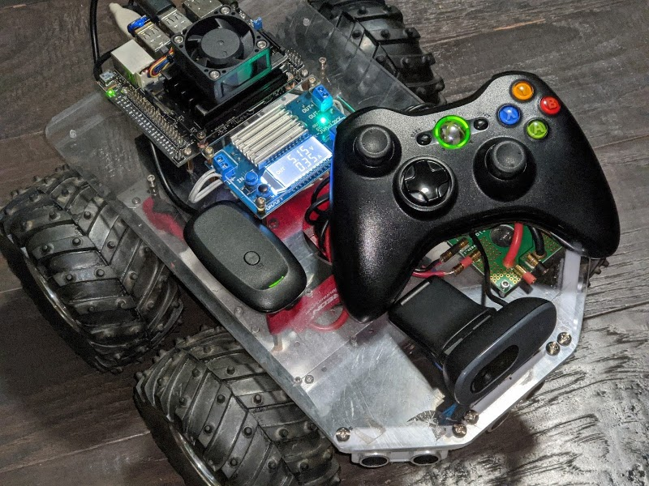
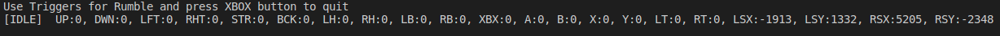

# XBOX360-CONTROLLER-API

I needed to use a XBOX 360 Controller on an AI & Robotics project at home 
and I did not want to be bound to Kernel level drivers or other external drivers.

So, I decided to write a XBOX 360 Controller API that works with directly with the 
XBOX 360 USB wireless PC adapter hardware and supports up to 4 controllers.

The second goal was to make this as cross platform as possible, so I ended up using libusb-1.0.0 
which supposedly can run on Linux, Mac and Windows. Althought right now I only have
support for Linux (The rest will come soon).

Its a very fast asyncronous API that supports all functions including rumble.

The API is super easy to use and I include a sample app.

Running The Example:
--------------------
- clone ths repo `git clone https://github.com/kooscode/xbox360-controller-api.git`
- Build the sample app by excuting: `make`
- Then run the sample app by executing: `sudo bin\controller-test` (see notes at the bottom)
- NOTE: You *might* need to install required package: `libusb-1.0-0-dev` (It came pre-installed on my NVIDIA Jetson Nano)

Using the API:
---------------
- Simply include `XBOX360.hpp` 
- Create an instance of `XBOX360` class and it will automatically detect a XBOX 360 Wireless adapter plugged into USB
- The API has 5 very simple functions:

  `void SetLED(ControllerIndex, LEDSetting)`
  - This Sets the Controller LED's  to 16 pre-set conditions, including effects like flashing and fanning. 
  - Check the `XBOX360Defines.hpp` file for pre-set enum called `LED_SETTING`

  `void SetRumble(ControllerIndex, BigWeight, SmallWeight)`
  - Rumble the Controller's Right Big and Left Small motors, valid values are 0-255
  - This function will rumble until you manually set the values back to zero to stop rumble.

  `void SetRumbleTimed(ControllerIndex, BigWeight, SmallWeight, RumbleTimeMS)`
  - Rumble the Controller's Right Big and Left Small motors, valid values are 0-255
  - This function will rumble using the supplied settings for a specific duration in milliseconds and will then automatically stop.

  `void GetControllerState(ControllerIndex, &ControllerState)`
  - Get the current Controller State, this will provide state for all Buttons, Triggers and Thumb Sticks.
  - Look in the `XBOX360Defines.hpp` file for the`CONTROLLER_STATE` struct that holds all controller state 

  `bool GetWaitControllerState(ControllerIndex, &ControllerState, TimeoutMS)`
  - This function will wait for a change received from the controller and then provide latest controller state upon change.
  - You can supply a Timeout value in milliseconds to wait for a controller change, if no change was detected, the function will return false and current values will be returned in the referenced controller state object.
  - Look in the `XBOX360Defines.hpp` file for the`CONTROLLER_STATE` struct that holds all controller state 

### **NOTES
- This API utilizes background running threads to constantly monitor all 4 controllers that might be connected to the Wireless receiver 
and you will get instantanous values from the controller when any changes occur.
- At this time you need to run your apps using `sudo` because this API will detach any existing Kernel drivers holding onto the controllers and access the hardware directly.

### Credits
Thanks to the `Xboxdrv` Linux User Space driver sources for hints as to the USB Report formats sent to the Wireless Controller. That helped a lot! (https://github.com/xboxdrv/xboxdrv)
